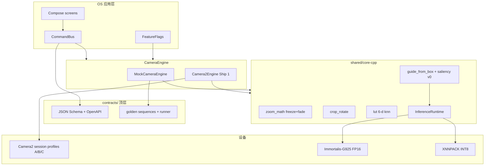
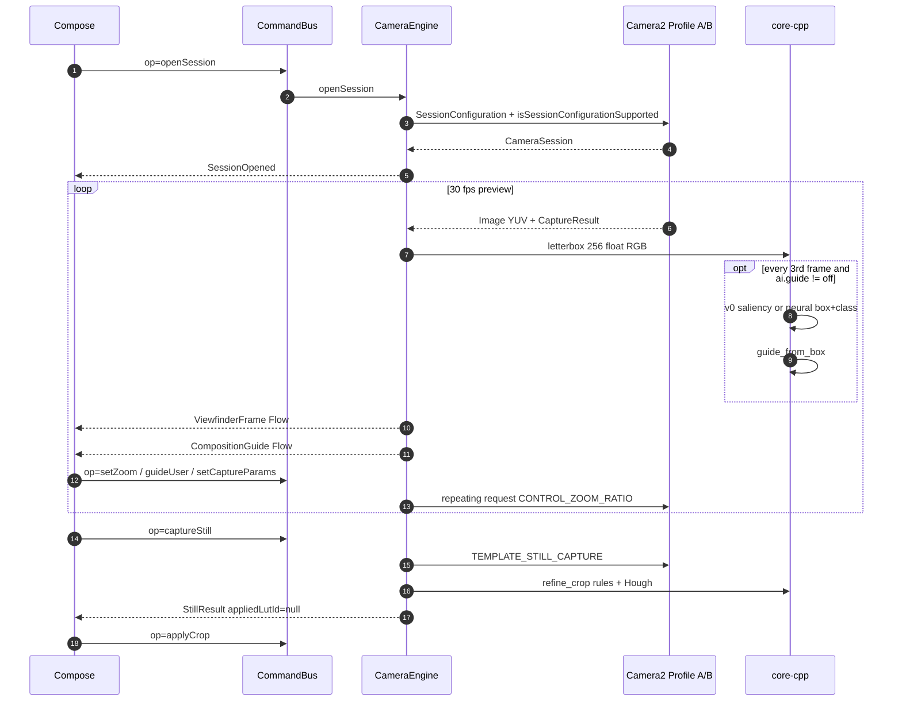
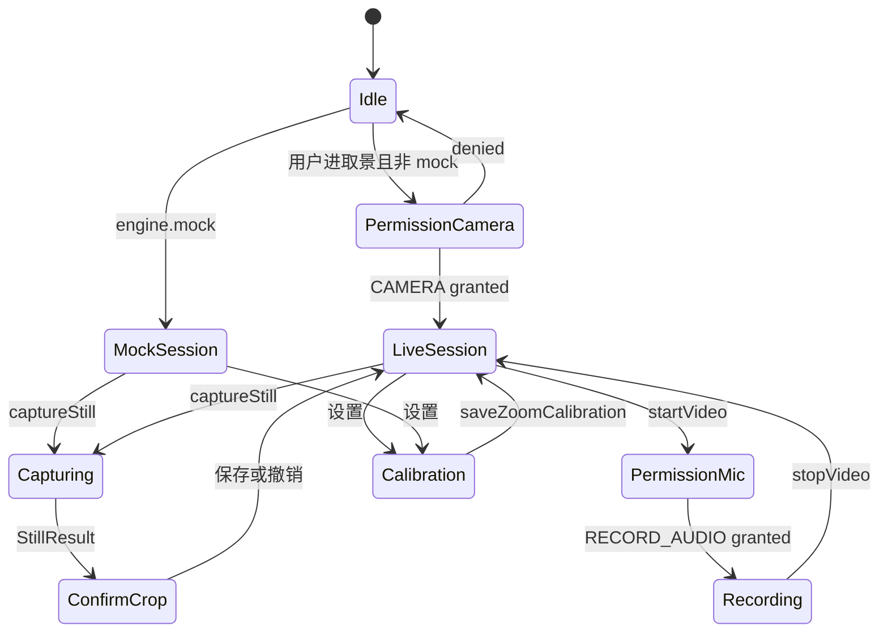
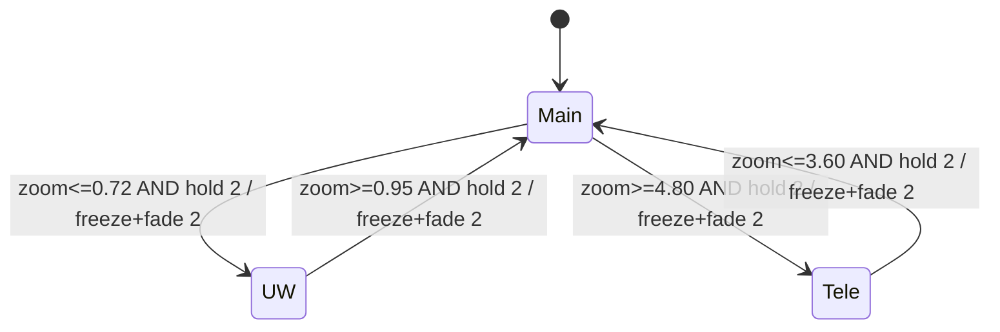
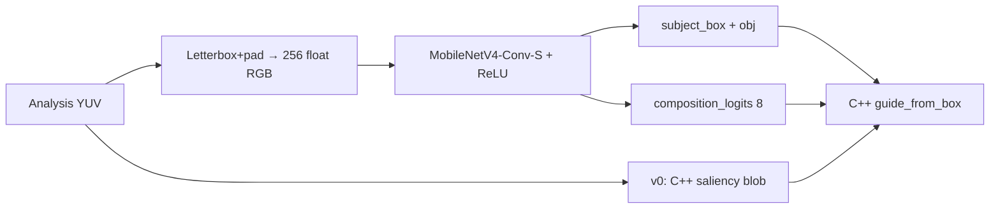
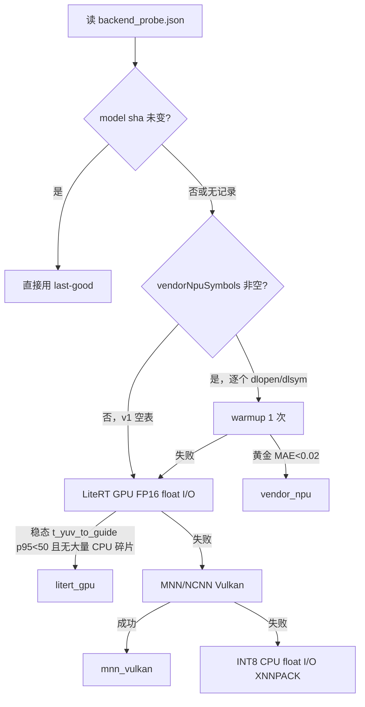

# AutoCam 设计文档：引导构图 · 自动裁切 · 滤镜推荐 · 低跳变跨镜变焦

| 字段 | 值 |
|------|----|
| 文档标题 | AutoCam Architecture & Implementation Design |
| 作者 | TBD（仓库维护者） |
| 日期 | 2026-09-11 |
| 修订 | 2026-09-11（Open Questions 全部已确认） |
| 状态 | Draft（PR-01 仓库骨架落地中） |
| 产品名 | AutoCam（显示名 AutoCam；包名 `com.autocam.app`） |
| 许可证 | Apache-2.0 |
| 工作区 | `D:\AutoCam`（当前仅 `初始提示词.txt`；下文路径均为**将要创建**的目标，不是现存代码） |
| 第一船硬件 | **已确认** Xiaomi 15S Pro（型号 `25042PN24C`，codename `dijun`，玄戒 O1 / HyperOS 2 / Android 15） |
| Git | https://github.com/gdd233333/AutoCam （public）；大节点 push |
| 受众 | 将按本文件落地实现的资深工程师 |

架构决策见文末 **## Key Decisions**。可合并 PR 切分见文末 **## PR Plan**（最后一节）。

---

## Overview

AutoCam 是一款以**引导构图 + 拍后自动裁切/微旋转 + 滤镜推荐 + 跨物理镜头低跳变变焦**为差异化的手机相机应用。仓库目前为空（仅 `D:\AutoCam\初始提示词.txt`），无代码、无 git 历史。本文是实现的唯一源文件。

方案采用 **API-first**：先冻结顶层 `contracts/`（不是 `shared/contracts`）与 `MockCameraEngine`，用 **JVM / Robolectric 金测试**（不是桌面 GUI）把构图 UI、滤镜芯片、变焦滑杆做完，再让 Camera HAL 适配同一套契约。可移植逻辑放在 `shared/core-cpp`；Camera HAL 100% 按 OS 原生实现。**禁止**把 Flutter `camera` 插件或 CameraX Preview-only 路径当作 HAL。

Ship 1 = Android HyperOS / AOSP + Jetpack Compose + Camera2。Huawei HarmonyOS NEXT 是 **已确认的 Ship 3**，不是 HyperOS，也不是第一船。iOS 为 Ship 2。

构图 AI 采用**单一冻结骨干 MobileNetV4-Conv-S + ReLU**，取景器图只出 box + 8 类；`guide_from_box()` 只在 C++。不在取景器跑 SAM / CLIP / VLM / mask / guide MLP。训练在 RTX 5070 Ti Laptop 上按 **12 GB VRAM** 规划。端侧产物拆成 **FP16 GPU 图** 与 **INT8 CPU 图**，二者均为 **float I/O**。无公开玄戒 NPU SDK；厂商 NPU 符号表初始为空。

跨镜 v1 算法是 **freeze+fade + 增益/色温/内裁**，不是双物理流 GL 交叉淡化。双物理流是机会主义 flag，默认关，直到 PR-07 HAL dump 证明组合被接受。

---

## Background & Motivation

### 当前状态

- 工作区 `D:\AutoCam` 仅有 `初始提示词.txt`。
- 无模块、无接口、无设备画像、无模型、无文档模板。下文所有路径（`contracts/`、`apps/android/...`、`ml/profiles/xiaomi_15s_pro.json`）是设计目标。
- 用户要求：先 plan，再任务最小化；每次更新 git commit；大更新在**有 remote 之后**才推 GitHub（当前无 URL，只本地 commit）；文档与功能同 PR；前端倒逼接口；轻量跨平台。

### 痛点

1. **物理镜头与完整变焦被 HAL 抽象吃掉。** Flutter `camera` / CameraX Preview 只暴露 logical + 数字变焦。
2. **构图引导是闭环控制。** 必须在预览运行时以 `t_yuv_to_guide` p95 ≤ 50 ms 产出 `CompositionGuide`，再在快门后做精裁切。MLLM 不可行。
3. **跨镜“跳”是标定+渲染。** 禁止生成缺失分辨率。
4. **玄戒 O1 NPU 没有公开 LiteRT delegate。** LiteRT NPU 路径覆盖 QNN / NeuroPilot / Tensor / Intel，不含 Xring。NNAPI 在 Android 15 已弃用，不假设有 Xring 驱动。

### 第一船设备画像（硬事实 vs 待 dump）

| 项 | 值 | 冻结？ |
|----|----|--------|
| 设备 | Xiaomi 15S Pro；同 SoC 第二机 Pad 7 Ultra | 匹配键冻结，能力以 dump 为准 |
| 型号 / codename | **`25042PN24C` / `dijun`**。`Build.MODEL` 含 `15S Pro` 为次要匹配 | 是 |
| SoC | 玄戒 O1，10 核 ~3.9 GHz | 是 |
| GPU | Immortalis-G925 MC16（Mali OpenCL/Vulkan） | 是 |
| NPU | 自研 6 核，约 44 TOPS。公开 die-shot 报 **16 MB** cache。**本设计不使用 NPU cache**，不按它 sizing | cache 数字不进入推理代码 |
| OS | **HyperOS 2 on AOSP Android 15**。不是 HarmonyOS NEXT | 是 |
| 内存 | 设备 16 GB；推理额外峰值仍按 ≤40 MB 规划 | 是 |
| 后置（营销锚点，仅作 bind hint） | 主 23 mm-e OIS + 超广 14 mm-e AF + 潜望 120 mm-e 5x OIS | `equiv35mm` 为 hint；`focalMm` / `fNumber` **必须**来自 `LENS_INFO_*` |
| 光学变焦锚点 | 14/23 ≈ **0.61x**，1.0x，120/23 ≈ **5.22x** | hint；`CONTROL_ZOOM_RATIO_RANGE` 以 dump 为准 |
| 视频 | HAL 探测；v1 默认 1080p30，4K30 仅当 Profile B 被 `isSessionConfigurationSupported` 接受 | 不写死 8K |

`Build.HARDWARE` **不要**写成 `"Xring O1"` 去匹配——该字段通常是板名。PR-07 dump 填入真实 `HARDWARE` / `DEVICE` / `PRODUCT`。

“鸿蒙”= **Huawei HarmonyOS NEXT = Ship 3**。此条为 **已确认默认**（不再作为 Open Question）。HyperOS/AOSP = Ship 1。

---

## Goals & Non-Goals

### Goals

1. 枚举并使用每一个后置物理镜头与 logical multi-camera 的完整 `CONTROL_ZOOM_RATIO` 范围（以 PR-07 dump 为准）。
2. 可调 + 自动的 ISO / 快门 / AE/AF/AWB / FPS / 分辨率 / 防抖 / `zoomRatio` / `physicalLensHint`。
3. 静物取景器：显著性主体 → 构图分类 → 引导用户把**主体中心**移到目标 → 建议焦段 → 拍后裁切与微旋转。v0 主体 = C++ 显著性 blob，不是人脸检测。
4. cube LUT + **6 维数值 k-NN**，外加 scene/composition **标签门控**。
5. 录像变焦：用户可标定；`zoom_apply_ms` < 33 ms（定义见 KD-18）；标定后切换观感 ≤ `fadeFrames`（默认 2）帧的 freeze+fade。
6. 端侧：取景器图 box+class，骨干 MNv4-Conv-S；**FP16 GPU 与 INT8 CPU 两份产物**，float I/O；`t_yuv_to_guide` p95 ≤ 50 ms（含色彩转换/letterbox/invoke/JNI/`guide_from_box`，**在预览运行时**测；不含 warmup）。每 3 帧一次。额外 RAM ≤ 40 MB（含 GPU working set）。
7. 契约先行：`contracts/` + Mock + CommandBus + 金测试，无真相机可开发 UI。
8. 文档与功能 **同 PR**，不另开文档堆积 PR。
9. 任务最小化、Conventional Commits、可独立 review 的 PR。PR-07 HAL dump 是后续 HAL/画像的硬门闩。

### Non-Goals（v1 明确不做）

- Flutter / CameraX Preview 作为 HAL。
- 取景器环路 SAM、CLIP、Grounding-DINO、VLM、mask 头、guide MLP。
- 从零训大 Transformer；在 5070 Ti 上微调 CLIP-ViT-L / SAM。
- 声称存在公开 Xring NPU SDK；把 `libmace.so` 当作第一希望。
- 采集/爬取用户私有相册。
- 生成式上色；超分脑补跨镜像素。
- 双物理流 crossfade（除非 dump 证明且打开 `zoom.dual_physical`）。
- Ship 1 做 iOS / HarmonyOS NEXT 功能对等。`apps/harmony` 不是可构建的 ArkTS 工程。
- 社交、云、账号、第三方分析 SDK。
- 完整 RAW/Lightroom 工作流（`capture.dng` / `capture.full_res` 默认关）。

---

## Proposed Design

### 1. 仓库布局（将要创建）

```
D:\AutoCam\
  .gitignore
  LICENSE                          # Apache-2.0
  README.md
  commitlint.config.cjs
  .github\
    PULL_REQUEST_TEMPLATE.md
    workflows\ci.yml               # PR-02 起：schema；PR-03：golden；PR-06：native test；PR-17：whitelist
  contracts\                       # 唯一契约根。没有 shared/contracts
    openapi.yaml
    command_envelope.schema.json   # 取代 jsonrpc.md
    schemas\
      OpenSessionRequest.schema.json
      CameraSession.schema.json
      CaptureParams.schema.json
      SetZoom.schema.json
      GuideUser.schema.json
      ViewfinderFrame.schema.json
      CompositionGuide.schema.json
      OverlayPrimitive.schema.json
      StillResult.schema.json
      ApplyCrop.schema.json
      VideoOptions.schema.json
      VideoSession.schema.json
      VideoClipResult.schema.json
      ZoomBlendProfile.schema.json
      DeviceProfile.schema.json
      FilterRecommendation.schema.json
      EngineEvent.schema.json
      CommandEnvelope.schema.json
    golden\
      README.md                    # runner 语义：fake clock / subset / N-frame
      sequences\
        set_zoom.json
        guide_user_pan_zoom.json
        capture_apply_crop.json
        worked_example_uw_to_main.json
      fixtures\
        still_object_table\        # 静物：桌上物体
        still_food\
        still_building\
        still_person\              # 可选偏置，不是 v0 主体来源
    mock\README.md
  apps\
    android\                       # PR-01 即空 Gradle 应用，可 ./gradlew assembleDebug
      settings.gradle.kts
      app\
        src\main\
          java\com\autocam\
            app\AutoCamApp.kt
            ui\                    # Compose screens
            engine\
              CameraEngine.kt
              CommandBus.kt
            mock\MockCameraEngine.kt
            hal\Camera2Engine.kt
            flags\FeatureFlags.kt
          cpp\jni_bridge.cpp       # PR-06 才编译
          assets\
            models\                # guide_viewfinder_fp16.tflite / guide_viewfinder_int8.tflite
            models\manifest.json
            luts\
            luts\manifest.json
            profiles\xiaomi_15s_pro.json
          res\xml\file_paths.xml
          AndroidManifest.xml
        src\test\                  # JVM / Robolectric 金测试
        src\androidTest\
    ios\README.md                  # Ship 2；空说明，无 Xcode 工程强迫编译
    harmony\README.md              # 首行：这不是 HyperOS；不要为 15S Pro 构建本目录
  shared\
    core-cpp\
      CMakeLists.txt               # PR-06 接入 Gradle externalNativeBuild
      include\autocam\
        types.h
        zoom_math.h
        crop_rotate.h
        lut.h
        inference.h
        composition.h              # guide_from_box + v0 saliency
        device_profile.h
      src\
      tests\
    ui\                            # 可选后期 Flutter shell，Ship 1 不建工程
  ml\
    README.md
    models\README.md               # sha256；权重不进 git
    datasets\manifest.yaml
    teachers\
    students\
      backbone.py                  # 仅 MobileNetV4-Conv-S + ReLU
      heads.py                     # box + obj + composition_8
      losses.py
    train\
      train_student.py
      distill.py
      qat.py
    export\
      to_onnx.py
      to_tflite_fp16.py
      to_tflite_int8.py
      to_mnn.py
      op_whitelist.yaml
      random_weight_export_ci.py   # 数据集之前就必须过
    profiles\
      xiaomi_15s_pro.json
    eval\
  docs\
    user\
    dev\
    ml\
```

大文件走 Git LFS 或 manifest URL + sha256，不进第一批 commit。

### 2. 分层架构



规则：

- UI **只**发 CommandBus 信封，零 Camera2 符号。
- `MockCameraEngine` 与 `Camera2Engine` 实现同一 `CameraEngine`；方法名 = 信封 `op` = schema 文件名。
- C++ 不持有 `ACamera*`。JNI 传入 YUV 指针。
- `apps/harmony` 与 `apps/ios` **不是**与 `apps/android` 对等的可构建 peer；仅 README，避免贡献者现在写 ArkTS。

### 3. 端到端数据流



### 4. Camera2 流组合矩阵（Ship 1 必读）

Android FULL / LEVEL-3 **保证**的组合大致是 `PRIV PREVIEW + YUV PREVIEW + JPEG MAXIMUM`。在此之上再加 4K record PRIV、分析 YUV、两个物理 YUV **不被保证**。因此 **禁止**假设“一个 immortal session 预分配 preview+still+video+analysis+dual-physical”。

打开任何 session 之前：

```kotlin
val config = SessionConfiguration(SESSION_REGULAR, outputs, executor, cb)
val ok = if (Build.VERSION.SDK_INT >= 35 && cameraDeviceSetup != null) {
    cameraDeviceSetup.isSessionConfigurationSupported(config)
} else {
    cameraDevice.isSessionConfigurationSupported(config)
}
if (!ok) fallbackToNextProfile()
```

PR-07 dump **必须**记录 Profile A/B/C 以及 dual-physical 候选的 `isSessionConfigurationSupported` 布尔值。后续 PR-08/10/12 **只消费 dump**，不得继续用本文的猜测尺寸当真值。

#### Profile A — `SessionProfile.STILL`（默认拍照）

| 槽 | 格式 | 目标尺寸 | Surface | 用途 |
|----|------|----------|---------|------|
| 0 | `PRIVATE` | 1920×1080（或 HAL 提供的 16:9 preview） | TextureView | 取景 |
| 1 | `YUV_420_888` | ≤1920×1080，优先 1280×720 | `ImageReader` maxImages=2 | 分析（letterbox→256） |
| 2 | `JPEG` | **默认 4096×3072 量级 binned ~12.5 MP**，不是 50 MP | `ImageReader` maxImages=1 | 静物 |

对应保证组合 `PRIV PREVIEW + YUV PREVIEW + JPEG MAXIMUM` 的子集（JPEG 用次大档而不是 sensor max）。`TEMPLATE_PREVIEW` repeating；静物用 `TEMPLATE_STILL_CAPTURE` 单发。

若 4096×3072 不被接受：沿 `StreamConfigurationMap` 降到下一档 4:3 JPEG，写入 `CameraSession.stillSizes`。50 MP（`capture.full_res=true`）仅当 dump 证明 JPEG MAXIMUM 与 preview+analysis 可共存。

#### Profile B — `SessionProfile.VIDEO`

| 槽 | 格式 | 目标尺寸 | Surface | 用途 |
|----|------|----------|---------|------|
| 0 | `PRIVATE` | 1920×1080 | TextureView | 取景 |
| 1 | `PRIVATE` | **默认 1920×1080**；4K 仅 dump 允许时 | `MediaCodec`/`MediaRecorder` persistent | 录像 |
| 2 | `YUV_420_888` | 1280×720 或更小 | ImageReader | 分析，**可选** |

`TEMPLATE_RECORD` repeating。若 `isSessionConfigurationSupported(A 的三流 + 4K record)` 为假：打开 Profile B 时 **允许重建 session**（拍照↔录像模式切换）。变焦在 **同一 session 内**不得重建。

若三流 B 被拒：丢掉槽 2，进入分析降级（见 Profile C 行为）。录像期间 `ai.guide` 可保持 `rule`（CPU 显著性，不占 GPU）或暂时 `off`。

#### Profile C — `SessionProfile.DEGRADED`

| 槽 | 格式 | Surface | 用途 |
|----|------|---------|------|
| 0 | `PRIVATE` preview | TextureView | 取景 |
| 1 | JPEG **或** record PRIV（由当前模式二选一） | ImageReader / MediaCodec | 拍或录 |

无分析 YUV。引导路径：

1. 优先跳过引导（`ai.guide=off` 并 `EngineEvent.code=stream_profile`）。
2. 或从 preview Texture 做 GPU/`ImageReader` 不可用时的 **极低频率** readback（调试用，不作为 50 ms SLO 路径）。

#### Dual-physical（非 v1 默认）

逻辑相机用两个同尺寸物理 YUV **替换**一条 logical YUV，且仅当 `isStreamCombinationSupported` / `isSessionConfigurationSupported` 为真。小米 Leica logical 对第三方经常 **不**在录像时给两条物理预览。

- Flag `zoom.dual_physical` **默认 false**。
- v1 切换算法 = **freeze+fade**（冻结上一帧 bitmap，新镜头第一帧 fade in，M=`fadeFrames`）。
- dump 证明之前，不得为 dual-physical 设计 session。

#### 会话模型（KD-14）

- 拍照：Profile A。
- `startVideo`：若 A 不能带 record surface，**重建为 Profile B**。这是允许的例外；不把“永不重建”写成不变量。
- `setZoom` / 镜头滞回：**禁止**重建 session。
- PR-07 dump 若证明 immortal 4K+analysis+JPEG 可行，再开 issue 合并会话；默认不赌。

### 5. 延迟预算

| 路径 | 目标 | 测量点 |
|------|------|--------|
| 预览出帧 | 30 fps | TextureView 实际呈现 |
| `t_yuv_to_guide` | p95 ≤ 50 ms @ O1 **GPU FP16 路径** | ImageReader 出帧 → letterbox+float 转换 → delegate invoke → `guide_from_box` → JNI 返回；**预览同时在跑**。Warmup **排除** |
| 引导叠加 | ≤ 1 预览帧 | Main 线程 immutable copy |
| `zoom_apply_ms` | < 33 ms | `setZoom` 返回调用方 → 下一帧 `ViewfinderFrame.zoomRatio` 与命令差 ≤ ε=0.02。**不是** photon、不是 vendor 动画结束 |
| 镜头切换观感 | ≤ `fadeFrames`（2） | freeze+fade 完成 |
| 快门 → `IS_PENDING` URI | < 400 ms **不含**全尺寸 JPEG encode | AF：CAF 下不等锁，或最多 200 ms；encode 异步 |
| 拍后精修 | 80–150 ms **含 decode** | 默认长边 **1024**；2048 仅当 1024 路径 <80 ms 再升级。超时则只出规则 crop、rotation=0 |
| GPU working set + 解释器 | ≤ 40 MB | FP16 图；INT8 CPU 路径更小 |
| 取景器 FP16 文件 | ~8 MB 量级（MNv4-S ~3.8M params × 2 B + 头） | 超出则砍 FC 头宽度，不引入第二骨干 |

INT8 文件给 CPU/XNNPACK，**不**宣称 LiteRT GPU 跑 INT8 数学（GPU 会 dequant 成 FP16/FP32，uint8 I/O 会在 CPU 上转）。

### 6. Feature flags

`apps/android/app/src/main/java/com/autocam/flags/FeatureFlags.kt`  
`SharedPreferences` 前缀 `flag.`。

| Flag | 类型 | 默认 | 含义 |
|------|------|------|------|
| `engine.mock` | bool | debug true / release false | 强制 Mock |
| `hal.multi_lens` | bool | false，PR-07 dump 成功后 true | 物理镜头 |
| `hal.zoom_ratio` | bool | true | `CONTROL_ZOOM_RATIO`，失败回退 crop region |
| `zoom.blend` | bool | false → PR-12/13 | 滞回 + freeze+fade |
| `zoom.dual_physical` | bool | **false** | 双物理流；dump 未证明不得开 |
| `ai.guide` | **enum** `off \| rule \| neural` | **`off`**，PR-14 → `rule`，PR-20 可 `neural` | 构图引导。**从 PR-05 起就是枚举**，无 boolean 迁移 |
| `ai.refine_still` | bool | false → PR-15 | 拍后 crop/rotate |
| `grade.lut` | bool | false → PR-16 | LUT |
| `capture.dng` | bool | false | |
| `capture.full_res` | bool | false | 50 MP JPEG；需 dump 组合支持 |
| `debug.include_hal_dump` | bool | **false** | 调试 zip 是否含 `hal_dump.json` |
| `debug.flag_secure` | bool | release true | 取景器 `FLAG_SECURE` |

能力未通过金测试 + 真机冒烟前保持默认。任何 AI/Blend 失败不得阻止拍照。

---

## UI contracts

Ship 1 倒逼路径是 **JVM/Robolectric + CommandBus**，不叫“桌面驱动”。`tools/mock_desktop` 不在 Ship 1。

### Screens

| Screen | 文件 | 职责 |
|--------|------|------|
| `PermissionGate` | `ui/PermissionGate.kt` | 相机权限；Mock 模式可跳过 |
| `ViewfinderScreen` | `ui/ViewfinderScreen.kt` | TextureView + overlay + 滑杆 + 快门 |
| `GuideOverlay` | `ui/GuideOverlay.kt` | 只绘 `overlay[]`，无命中测试 |
| `CaptureConfirmScreen` | `ui/CaptureConfirmScreen.kt` | 未裁原图 + 裁切框 + 撤销 |
| `FilterChips` | `ui/FilterChips.kt` | LUT chip，确认才 `applyCrop(bakeLut=true)` |
| `CalibrationScreen` | `ui/CalibrationScreen.kt` | 滞回/增益/色温/内裁 |
| `DebugSettings` | `ui/DebugSettings.kt` | flags、导出 zip、backend probe |

### UI 状态机



### Threading

| 线程 | 拥有 |
|------|------|
| Camera `HandlerThread` | `CameraDevice`、session、`ImageReader.acquireLatestImage`、repeating request |
| Analysis `Executor`（单线程） | YUV→float RGB letterbox、v0 saliency 或 delegate invoke、`guide_from_box` |
| Main / Compose | 收集 Flow；`CompositionGuide` 做成 immutable snapshot |
| GL | **v1 不作为相机管线所有者**。LUT 预览：CPU 16³ 采样到 overlay 或 Compose `ColorFilter` 近似；freeze+fade = 两张 bitmap 的 Compose alpha。PR-07 之后若 dual-physical 成立再考虑 EGL |

禁止在 GL 线程跑推理。`guides` 10 Hz 与 `frames` 30 Hz 解耦：overlay 持有**最新一份** guide，直到下一份到来，不做跨帧插值（避免箭头抖动）。

### Overlay 坐标（唯一约定）

- 归一化取景器：原点**左上**，x 右，y 下，范围 [0,1]。
- 已补偿 `ViewfinderFrame.rotationDeg`。Compose 把 overlay `Box` 与 TextureView **像素对齐**，`px = nx * width`。
- `targetNx/Ny` = **希望主体中心去的位置**。`pan_arrow.dx/dy` = `target - subjectCenter`。
- z-order（底→顶）：preview → `grid_thirds` → `subject_box` → `pan_arrow` → `target_reticle` → `horizon_line` → `hint_text` → chips/slider。
- `hint_text.key` 只是 strings.xml 键，例如 `guide.move_subject_to_reticle`。JSON 不含用户可见自然语言。
- Overlay **无 hit testing**。

### CommandBus

`engine/CommandBus.kt`：Compose 与 GoldenRunner **共用**。每次 UI 动作编码为：

```json
{ "op": "setZoom", "id": "3", "body": { "zoomRatio": 2.0, "rate": "immediate", "source": "user_slider" } }
```

`id` 单调字符串。引擎结果不走 JSON-RPC；测试用 subset matcher 对后续 frame/guide/event 断言。不存在 `contracts/jsonrpc.md`。

PR-04 门禁：Robolectric 拖动变焦滑杆，CommandBus 录到的信封必须与 `contracts/golden/sequences/set_zoom.json` 的 `send` **字段级 subset 相等**。

### Golden runner 语义（`contracts/golden/README.md`）

- **Fake clock**：`MockCameraEngine.advanceNs(int64)`；`withinMs` 比较的是 fake time，不是 wall clock。
- **Subset match**：期望对象的每个键必须存在于实际 JSON 且深等；实际可有多余键。
- **N-frame 窗口**：`expectFrame` 默认在随后 3 帧内命中。
- **`GuideUser` 对 fixture 的效应**：标注主体中心 `s += (panNx, panNy) * step`（step 默认 0.25 / 帧），`zoomRatio` 按 `rate` 收敛。轨迹必须在 `guide_user_pan_zoom.json` 里写死期望中心。
- 像素不进 JSON。`previewHandle` 仅进程内。

---

## API / Interface Changes

UI 与引擎的**唯一边界**是下面这张闭包。Kotlin 方法名 = 信封 `op` = `contracts/schemas/<Op>.schema.json`。

### 1. 闭包：命令 / 结果 / 流

| `op` / 流 | Kotlin | Schema | 方向 |
|-----------|--------|--------|------|
| `openSession` | `suspend fun openSession(req: OpenSessionRequest): CameraSession` | `OpenSessionRequest` + `CameraSession` | UI→Eng |
| `closeSession` | `suspend fun closeSession()` | 无 body | UI→Eng |
| `setCaptureParams` | `fun setCaptureParams(params: CaptureParams)` | `CaptureParams` | UI→Eng |
| `setZoom` | `fun setZoom(cmd: SetZoom)` | `SetZoom` | UI→Eng |
| `setPhysicalLensHint` | `fun setPhysicalLensHint(lensId: String?)` | body `{ "lensId": "physical_main" \| null }` | UI→Eng |
| `guideUser` | `fun guideUser(cmd: GuideUser)` | `GuideUser` | UI→Eng |
| `captureStill` | `suspend fun captureStill(): StillResult` | `StillResult` | UI→Eng |
| `startVideo` | `suspend fun startVideo(opts: VideoOptions): VideoSession` | `VideoOptions` + `VideoSession` | UI→Eng |
| `stopVideo` | `suspend fun stopVideo(): VideoClipResult` | `VideoClipResult` | UI→Eng |
| `applyCrop` | `fun applyCrop(cmd: ApplyCrop): StillResult` | `ApplyCrop` + `StillResult` | UI→Eng |
| `loadDeviceProfile` | `fun loadDeviceProfile(json: String)` | `DeviceProfile` | UI→Eng |
| `saveZoomCalibration` | `fun saveZoomCalibration(profile: ZoomBlendProfile)` | `ZoomBlendProfile` | UI→Eng |
| （流） | `fun frames(): Flow<ViewfinderFrame>` | `ViewfinderFrame` | Eng→UI |
| （流） | `fun guides(): Flow<CompositionGuide>` | `CompositionGuide` | Eng→UI |
| （流） | `fun filters(): Flow<FilterRecommendation>` | `FilterRecommendation` | Eng→UI |
| （流） | `fun events(): Flow<EngineEvent>` | `EngineEvent` | Eng→UI |

`CameraCapabilities` **不**单独存在，已并入 `CameraSession`。不要再写 `fun capabilities()`。

```kotlin
interface CameraEngine {
    suspend fun openSession(req: OpenSessionRequest): CameraSession
    suspend fun closeSession()
    fun setCaptureParams(params: CaptureParams)
    fun setZoom(cmd: SetZoom)
    fun setPhysicalLensHint(lensId: String?)
    fun guideUser(cmd: GuideUser)
    fun frames(): Flow<ViewfinderFrame>
    fun guides(): Flow<CompositionGuide>
    fun filters(): Flow<FilterRecommendation>
    fun events(): Flow<EngineEvent>
    suspend fun captureStill(): StillResult
    suspend fun startVideo(opts: VideoOptions): VideoSession
    suspend fun stopVideo(): VideoClipResult
    fun applyCrop(cmd: ApplyCrop): StillResult
    fun loadDeviceProfile(json: String)
    fun saveZoomCalibration(profile: ZoomBlendProfile)
}
```

### 2. Overlay `type` 枚举（闭包）

`grid_thirds | subject_box | target_reticle | pan_arrow | hint_text | horizon_line`

各 type 字段：

- `grid_thirds`: `{ "type", "opacity" }`
- `subject_box`: `{ "type", "box": {x0,y0,x1,y1} }`
- `target_reticle`: `{ "type", "nx", "ny" }`
- `pan_arrow`: `{ "type", "dx", "dy" }`
- `hint_text`: `{ "type", "key" }`
- `horizon_line`: `{ "type", "angleDeg", "opacity" }`

### 3. `EngineEvent.code` 目录（闭包）

`session_open | session_close | session_error | stream_profile | lens_switch | lens_hint_ignored | freeze_fade | inference_backend | inference_ms | inference_fallback | capture_ms | zoom_cmd_ms | zoom_apply_ms | params_rejected | permission_needed | hal_dump_saved | backend_probe_restored`

`level`: `debug | info | warn | error`。

### 4. 字段约定：`equiv35mm` vs `focalMm`

| 字段 | 含义 | 来源 |
|------|------|------|
| `equiv35mm` | 35 mm 等效，bind hint（14 / 23 / 120） | DeviceProfile hint；运行时也可用 `focalMm * 36 / sensorWidthMm` 复核 |
| `focalMm` | 光学焦距 mm | **只**来自 `LENS_INFO_AVAILABLE_FOCAL_LENGTHS` |
| `fNumber` | 光圈 | **只**来自 `LENS_INFO_AVAILABLE_APERTURES` |
| `opticalZoom` | `equiv35mm / mainEquiv35mm` | 计算值 |

Mock 在无 HAL 时可用 hint 填 `equiv35mm`，`focalMm` 用典型值（主 ~6.8，超广 ~2.2，潜望 ~15–18）并在 fixture 注释标明“mock，非 dump”。

### 5. JSON 示例（与 worked example 同一套数）

`OpenSessionRequest.engine` 是解析器输入。若 `flag.engine.mock=true`，**强制** `"mock"`，忽略请求里的 `"camera2"`。

#### `OpenSessionRequest`

```json
{
  "facing": "back",
  "profileId": "xiaomi.15s_pro.hyperos2",
  "previewMaxFps": 30,
  "previewMaxWidth": 1920,
  "sessionProfile": "still",
  "aiGuide": "off"
}
```

`sessionProfile`: `still | video | degraded`。无 `engine` 字段——引擎选择由 flag + 可用性决定，避免与 `engine.mock` 双写。信封外层由测试注入 Mock。

#### `CameraSession`（Mock 在 dump 前的合法值；真机以 dump 覆盖）

```json
{
  "sessionId": "sess_01",
  "logicalCameraId": "0",
  "facing": "back",
  "sessionProfile": "still",
  "zoomRatioRange": { "min": 0.61, "max": 10.0 },
  "supportsLogicalMultiCamera": true,
  "supportsControlZoomRatio": true,
  "lenses": [
    {
      "lensId": "physical_uw",
      "physicalCameraId": null,
      "role": "ultrawide",
      "focalMm": 2.2,
      "equiv35mm": 14.0,
      "fNumber": null,
      "opticalZoom": 0.61,
      "hasOis": false,
      "hasAf": true
    },
    {
      "lensId": "physical_main",
      "physicalCameraId": null,
      "role": "main",
      "focalMm": 6.8,
      "equiv35mm": 23.0,
      "fNumber": null,
      "opticalZoom": 1.0,
      "hasOis": true,
      "hasAf": true
    },
    {
      "lensId": "physical_tele",
      "physicalCameraId": null,
      "role": "tele",
      "focalMm": 15.5,
      "equiv35mm": 120.0,
      "fNumber": null,
      "opticalZoom": 5.22,
      "hasOis": true,
      "hasAf": true
    }
  ],
  "aeModes": ["off", "on", "on_auto_flash"],
  "afModes": ["off", "auto", "continuous_picture", "continuous_video"],
  "awbModes": ["off", "auto", "incandescent", "daylight", "cloudy"],
  "isoRange": { "min": 50, "max": 6400 },
  "exposureNsRange": { "min": 25000, "max": 1000000000 },
  "fpsRanges": [[15, 15], [30, 30]],
  "stillSizes": [[4096, 3072], [1920, 1440]],
  "videoSizes": [[1920, 1080]],
  "stabilization": ["off", "eis", "ois"]
}
```

`physicalCameraId` / `fNumber` 在真机 dump 前为 `null`。禁止在 Kotlin 写死 `"2"`。

#### `CaptureParams`

```json
{
  "aeMode": "on",
  "afMode": "continuous_picture",
  "awbMode": "auto",
  "iso": null,
  "exposureNs": null,
  "focusDistance": null,
  "wbCctK": null,
  "evBias": 0.0,
  "fps": 30,
  "stabilization": "ois",
  "zoomRatio": 1.0,
  "physicalLensHint": null,
  "stillSize": [4096, 3072],
  "videoSize": [1920, 1080],
  "jpegQuality": 95
}
```

`aeMode != "off"` 时 `iso`/`exposureNs` 必须 null。

#### `SetZoom` / `GuideUser` / `ApplyCrop` / `VideoOptions`

```json
{ "zoomRatio": 0.70, "rate": "immediate", "source": "user_slider" }
```

```json
{ "panNx": -0.12, "panNy": -0.08, "zoomRatio": 1.8, "followSuggested": true }
```

```json
{
  "sourceUri": "content://com.autocam.app.fileprovider/stills/20260911_001.jpg",
  "cropBoxNorm": { "x0": 0.06, "y0": 0.04, "x1": 0.94, "y1": 0.90 },
  "rotationDeg": -1.8,
  "lutId": "lut.warm_v1",
  "bakeLut": false
}
```

```json
{ "size": [1920, 1080], "fps": 30, "audio": true, "stabilize": true }
```

`VideoSession`: `{ "sessionId", "uriPending", "size", "fps" }`。`VideoClipResult`: `{ "uri", "durationMs", "size" }`。

#### `ViewfinderFrame` / `StillResult`

```json
{
  "timestampNs": 1,
  "previewKind": "yuv420",
  "previewHandle": "opaque:frame:42",
  "width": 1920,
  "height": 1080,
  "rotationDeg": 90,
  "zoomRatio": 0.70,
  "activePhysicalCamera": null,
  "activeLensId": "physical_uw",
  "iso": 125,
  "exposureNs": 10000000,
  "focalMm": 2.2
}
```

`StillResult.appliedLutId` 在快门时为 **`null`**。只有 `applyCrop` 且 `bakeLut=true` 后才写入。默认预览 LUT 不 bake。

### 6. 一条 worked example（数字全部来自上表）

`contracts/golden/sequences/worked_example_uw_to_main.json`：

1. `openSession` `{ facing: back, sessionProfile: still, aiGuide: rule }` → `CameraSession.zoomRatioRange.min=0.61`，三颗 `lensId`。
2. `setZoom` `{ zoomRatio: 0.70, rate: immediate, source: test }`。
3. 等待 `hysteresisFrames=2` 后 `expectFrame` `{ zoomRatio: 0.70, activeLensId: "physical_uw" }`；`expectEvent` `{ code: "lens_switch" }` 然后 `{ code: "freeze_fade" }`。
4. `setZoom` `{ zoomRatio: 1.20, rate: immediate }`。
5. zoom 过 `upSwitch=0.95` 并 hold 2 帧 → `activeLensId: "physical_main"`，`zoomRatio: 1.20`。
6. `captureStill` → `StillResult` `{ width: 4096, height: 3072, appliedLutId: null, cropBoxNorm 非单位框, activeLensId: "physical_main" }`。
7. `filters` 流至少含 `{ lutId: "lut.warm_v1" }`（若 `grade.lut` 开；本序列默认关则可缺省）。
8. `applyCrop` `{ lutId: "lut.warm_v1", bakeLut: false }` → 仍 `appliedLutId: null`，文件为裁切未上 LUT。
9. 再 `applyCrop` `{ bakeLut: true }` → `appliedLutId: "lut.warm_v1"`。

### 7. C++ 符号

```cpp
namespace autocam {

struct Box { float x0, y0, x1, y1; };
struct Guide {
  float target_nx, target_ny, suggested_zoom, confidence;
  const char* composition_class;
  Box subject_box;
};
struct FrameMeta {
  int64_t timestamp_ns;
  int width, height, rotation_deg;
  float zoom_ratio;
  const char* active_lens_id;
};

Box v0_saliency_box(const uint8_t* gray, int w, int h); // center-surround / Sobel energy
Guide guide_from_box(const Box& subject, const char* composition_class,
                     float current_zoom, float zoom_min, float zoom_max);

// viewfinder net: float RGB 256, outputs box+obj+logits. NO mask, NO guide_vec, NO edge tensor.
struct NetOut { Box box; float obj; float logits[8]; };

Box refine_crop(const uint8_t* rgb, int w, int h,
                const Box& subject, const char* composition_class);
float refine_rotation_deg(const uint8_t* gray, int w, int h);
}
```

JNI 不把全幅 Bitmap 拷进 JVM。Letterbox（不是 stretch）在 native 完成。

---

## Data Model Changes

无服务端库。本地文件：

- `files/profiles/{profileId}.user.json` — 只覆盖 `zoomBlend.*`
- `files/profiles/backend_probe.json` — 上次成功 backend
- `files/hal_dump.json` — PR-07 产物；默认不进 debug zip
- `files/logs/autocam.log` — 4 MB 环
- MediaStore `Pictures/AutoCam` + FileProvider `content://com.autocam.app.fileprovider/stills/`

### 1. `DeviceProfile`

路径：`ml/profiles/xiaomi_15s_pro.json` → 构建拷到 assets。

```json
{
  "profileId": "xiaomi.15s_pro.hyperos2",
  "match": {
    "manufacturer": ["Xiaomi"],
    "modelContains": ["15S Pro"],
    "modelCodes": ["25042PN24C"],
    "productOrDevice": ["dijun"]
  },
  "osNote": "HyperOS 2 / Android 15. Not HarmonyOS NEXT.",
  "hardwareNote": "Do not match Build.HARDWARE to 'Xring O1' until hal_dump fills it.",
  "lenses": [
    {
      "lensId": "physical_uw",
      "role": "ultrawide",
      "equiv35mm": 14.0,
      "opticalZoom": 0.61,
      "hasOis": false,
      "hasAf": true,
      "bindBy": { "equiv35mmTol": 3.0 }
    },
    {
      "lensId": "physical_main",
      "role": "main",
      "equiv35mm": 23.0,
      "opticalZoom": 1.0,
      "hasOis": true,
      "hasAf": true,
      "bindBy": { "equiv35mmTol": 3.0 }
    },
    {
      "lensId": "physical_tele",
      "role": "tele",
      "equiv35mm": 120.0,
      "opticalZoom": 5.22,
      "hasOis": true,
      "hasAf": true,
      "bindBy": { "equiv35mmTol": 15.0 }
    }
  ],
  "zoomBlend": {
    "hysteresisFrames": 2,
    "fadeFrames": 2,
    "algorithm": "freeze_fade",
    "breakpoints": [
      {
        "fromLensId": "physical_uw",
        "toLensId": "physical_main",
        "upSwitch": 0.95,
        "downSwitch": 0.72,
        "hideSwitchCropNorm": 0.02
      },
      {
        "fromLensId": "physical_main",
        "toLensId": "physical_tele",
        "upSwitch": 4.80,
        "downSwitch": 3.60,
        "hideSwitchCropNorm": 0.03
      }
    ],
    "gainMatch": { "physical_uw": 1.00, "physical_main": 1.00, "physical_tele": 1.08 },
    "cctOffsetK": { "physical_uw": 0, "physical_main": 0, "physical_tele": -150 }
  },
  "inference": {
    "preferredBackendOrder": ["litert_gpu", "mnn_vulkan", "cpu_int8"],
    "vendorNpuSymbols": [],
    "gpuName": "Immortalis-G925",
    "inputSide": 256,
    "runEveryNFrames": 3,
    "viewfinderFp16": "models/guide_viewfinder_fp16.tflite",
    "viewfinderInt8": "models/guide_viewfinder_int8.tflite"
  }
}
```

画像 **不**冻结 `fNumber` / `focalMm`。Bind：`focalMm`（dump）+ `SENSOR_INFO_PHYSICAL_SIZE` → 估算 35e → 与 `equiv35mm` 比容差。失败则 `lensId=physical_{cameraId}`，`zoom.blend` 降级。

### 2. 变焦状态机（无 Crossfade 状态）

状态只有 UW / Main / Tele。边上写动作 `{hold hysteresisFrames, freeze+fade fadeFrames}`。



逻辑变焦始终相对主摄 1.0x。切换时：

1. repeating request 只改 `CONTROL_ZOOM_RATIO`（或 crop region 回退）。
2. 读 `LOGICAL_MULTI_CAMERA_ACTIVE_PHYSICAL_ID`。
3. 预览渲染乘 `gainMatch`、加 `cctOffsetK`（不写进 DNG）。
4. `hideSwitchCropNorm` 内裁。
5. **冻结上一帧**，新镜头首帧在 `fadeFrames` 内 alpha 淡入。不是 GL 双纹理 mix，除非 `zoom.dual_physical`。
6. 无传感器覆盖的倍率只 digital crop，禁止超分。

### 3. HAL 其余细节

**枚举（PR-07，硬门闩）** 写出 `hal_dump.json`：

- `Build.MODEL` / `DEVICE` / `PRODUCT` / `HARDWARE` / `MANUFACTURER`
- 每个 cameraId：facing、caps、physicalIds、`LENS_INFO_AVAILABLE_FOCAL_LENGTHS`、`LENS_INFO_AVAILABLE_APERTURES`、`CONTROL_ZOOM_RATIO_RANGE`、sensor size、level
- Profile A/B/C 与 dual-physical 候选的 `isSessionConfigurationSupported`
- 是否存在公开 **Xiaomi 相机生态引擎 SDK**（见 Alternative G）

打开：优先 back + logical multi-camera。若 OEM 把 UW/Tele 做成独立 logical，用 `opticalZoom` 做应用层 logical（R1）。

**变焦**：`CONTROL_ZOOM_RATIO` 优先。变焦不重建 session。

**参数映射**

| CaptureParams | Camera2 key |
|---------------|-------------|
| `aeMode` | `CONTROL_AE_MODE` |
| `iso` | `SENSOR_SENSITIVITY`（仅 AE off） |
| `exposureNs` | `SENSOR_EXPOSURE_TIME` |
| `evBias` | `CONTROL_AE_EXPOSURE_COMPENSATION` |
| `afMode` | `CONTROL_AF_MODE` |
| `focusDistance` | `LENS_FOCUS_DISTANCE`（AF off） |
| `awbMode` | `CONTROL_AWB_MODE` |
| `wbCctK` | 无直接 key：用 `COLOR_CORRECTION_GAINS` + `TRANSFORM1` 近似，或保持 auto |
| `fps` | `CONTROL_AE_TARGET_FPS_RANGE` |
| `stabilization` | `LENS_OPTICAL_STABILIZATION_MODE` / `CONTROL_VIDEO_STABILIZATION_MODE` |
| `zoomRatio` | `CONTROL_ZOOM_RATIO` |
| `physicalLensHint` | `OutputConfiguration.setPhysicalCameraId`（仅当 capability 允许独立物理流） |

`physicalLensHint` 是提示；拒绝则 `lens_hint_ignored`。

**静物**：JPEG，默认 binned 12.5 MP。CAF 下不等 AF lock；非 CAF 最多等 200 ms。`MediaStore` `IS_PENDING`。URI 经 FileProvider 暴露。

**录像**：Profile B；模式切换可重建；录中变焦不重建。若切镜停录（R7）：锁定当前物理镜头 + digital crop + UI 提示。

**禁止**：未文档 `xiaomi.camera.*` 反射。公开 Camera Engine SDK 走 Alternative G，不走反射。

### 4. iOS / HarmonyOS NEXT

| OS | 状态 | HAL |
|----|------|-----|
| iOS Ship 2 | `apps/ios/README.md` 待办 | `AVCaptureDevice.DiscoverySession`、`videoZoomFactor`、constituent devices |
| HarmonyOS NEXT Ship 3 | `apps/harmony/README.md` **首行写明：不是 HyperOS，不要为 15S Pro 构建** | `@ohos.multimedia.camera`；`CONTROL_ZOOM_RATIO` 的 Kit 对应类型在 Ship 3 再映射，不在 Ship 1 假装对等 |

---

## 构图 AI

### 1. 取景器级联（冻结）



- **单一输入** `preview_rgb` float32 `[1,256,256,3]`。无 `edge_map` 网络输入（避免 GPU delegate 按空间尺寸切图）。
- **无 mask 头、无 guide MLP、无 `guide_vec`。**
- C++ Sobel/center-surround 只服务于 **v0 主体** 与拍后 Hough，不进 TFLite。
- `ai.guide=rule`：v0 box + 规则 class（三分/中心启发式）+ `guide_from_box`。
- `ai.guide=neural`：网络 box+class 替换主体与类，几何仍是 `guide_from_box`。

### 2. 张量形状（取景器图，CI assert）

| Tensor | I/O | Shape | Dtype |
|--------|-----|-------|-------|
| `preview_rgb` | in | `[1,256,256,3]` NHWC | **float32**（0–1） |
| `subject_box` | out | `[1,4]` | float32 `cx,cy,w,h` 相对 **letterbox 256**，调用方映射回取景器 |
| `subject_obj` | out | `[1,1]` | float32 sigmoid |
| `composition_logits` | out | `[1,8]` | float32 |

禁止导出 `subject_mask`、`guide_vec`、`edge_map`。

产物：

| 文件 | 用途 |
|------|------|
| `guide_viewfinder_fp16.tflite` | LiteRT GPU，FP16 权重，float I/O |
| `guide_viewfinder_int8.tflite` | XNNPACK CPU，INT8 权重，**仍 float I/O**（图内 QUANTIZE/DEQUANTIZE） |

可选第三文件：still crop ranker（仅 PR-21，非取景器）。

### 3. 尺寸表（PR-17 学生图；文件体积以 `random_weight_export_ci.py` 打印为准）

| 项 | 规划 / 实测 |
|----|------|
| MNv4-Conv-S 骨干+取景器头 | **1.27M** params（无 ImageNet 1000 类 FC；完整分类模型才约 3.8M） |
| FP16 文件 | 目标 < 12 MB |
| INT8 文件 | 目标 < 8 MB |
| 峰值激活（256，无 FPN） | ~8–15 MB |
| GPU working set | 计入 40 MB 上限 |
| 训练 VRAM | **按 12 GB 规划**（5070 Ti Laptop 典型），教师预推理离卡 |

### 4. 8 类映射

| Runtime | CADB | PICD 折叠 |
|---------|------|-----------|
| `thirds` | rule of thirds, golden ratio | P-RoT, S-RoT |
| `center` | center | P-Cent, S-Cent |
| `diagonal` | diagonal | P-Dia |
| `triangle` | triangle | triangle |
| `leading_line` | horizontal, vertical, vanishing, radial | 引导线类 |
| `symmetric` | symmetric | 对称 |
| `fill_frame` | fill the frame | dense/fill |
| `none` | none, pattern | scatter |

PICD 折叠后类别不平衡：训练用 **class-weighted CE** 或对 `none`/稀有类过采样。脚本在 `ml/datasets/fold_picd_to_8.py`。

### 5. `guide_from_box()`（唯一几何，C++ 与 UI 共用语义）

`s` = 主体中心。`t`：

| class | `t` |
|-------|-----|
| `thirds` | 四个三分交点最近者 |
| `center` / `symmetric` | (0.5, 0.5) |
| `diagonal` | 主对角线上距 s 最近，夹在 [0.2,0.8] |
| `triangle` | (0.5, 0.66) |
| `leading_line` | 沿最长边把 s 推到三分线 |
| `fill_frame` | (0.5, 0.5)，zoom 使长边 → 0.92 |
| `none` | `t = s`，zoom 不变 |

`pan = t - s`。`suggestedZoom`：`fill_frame` 用 `current * 0.92 / max(w,h)`；其他把面积比推入 [0.08, 0.22]；clamp 到 range。

后续若要学习 zoom residual，新 flag `ai.guide_residual`，**不**进入 v1 冻结图。

### 6. v0 主体（静物，不是人脸）

`v0_saliency_box`：

1. 分析帧转灰度（letterbox 前的分析 YUV）。
2. 积分图 center-surround（内窗 ~1/8 短边，外窗 ~1/3）+ Sobel 能量。
3. 取最大连通域（阈值 = 均值 + 1σ），输出 box。
4. 若最大域面积 < 1.5% 画面 → class `none`，不引导。
5. **不**调用 `android.media.FaceDetector`。人脸若未来加，只作为可选偏置，且必须 on-device、有 flag。

金样本：`still_object_table`、`still_food`、`still_building` 为 v0 必过；`still_person` 仅回归“有脸也不依赖 FaceDetector”。

### 7. 拍后精修

v0（PR-15）**规则即可**：`refine_crop(subject, class)` + Hough ±15°。无 ranking 网络。

Decode：长边默认 1024。预算 80–150 ms **含 decode**；超时则 rotation=0、crop 用取景器 box 映射。

神经网络 crop 头（GAIC ranking）仅 PR-21 可选；`λ_rank` **只**挂在该头上，不进取景器学生。

`refine_crop` **不**接收网络 `Guide` 向量。

### 8. Op 白名单

冻结骨干：**MobileNetV4-Conv-S，激活 ReLU**（折叠后无 hybrid/attention）。**禁止** EfficientViT-M0、PicoDet-S，除非另开 appendix 证明 LiteRT GPU 全图接管（当前不排期）。

`ml/export/op_whitelist.yaml` **必须**含：

`CONV_2D`, `DEPTHWISE_CONV_2D`, `FULLY_CONNECTED`, `ADD`, `MUL`, `CONCATENATION`, `PAD`, `RESIZE_BILINEAR`, `AVERAGE_POOL_2D`, `MEAN`, `SOFTMAX`, `LOGISTIC`, `RESHAPE`, `TRANSPOSE`, **`RELU`**, **`QUANTIZE`**, **`DEQUANTIZE`**

允许但需在随机权重导出日志中出现才算“启用”：`STRIDED_SLICE`, `MAXIMUM`, `MINIMUM`（clip）。**禁止** `PRELU`（本骨干用 ReLU）、custom、`Einsum`、控制流、`NonMaxSuppression`、`Scatter`。

CI：`random_weight_export_ci.py` 在 **任何数据集下载之前** 必须：建学生 → ONNX → 两份 tflite → opcode ⊆ 白名单。PR-17 落地。

### 9. 推理回退



要点：

1. 不写“LiteRT 支持 Xring NPU”。
2. **`vendorNpuSymbols` 初始 `[]`。** 不把 `libmace.so` 写成第一希望。MACE 公开树不是 Xring SDK。空表 ⇒ 跳过 vendor 档。
3. NNAPI：可探测 `ANeuralNetworks_getDeviceCount`，当普通候选，不假设存在。
4. GPU 路径加载 **FP16** 图；CPU 路径加载 **INT8** 图。
5. BackendProbe **持久化**。Cold start 不连跑 4 个 runtime。模型 sha 变化或 debug 按钮才重探。
6. Warmup 允许远超 50 ms。SLO 只约束稳态 p95。
7. last-good 为 GPU、本次跌到 CPU → `inference_fallback` warn。

### 10. 训练（12 GB VRAM）

禁止：从零 SAM/CLIP；教师与学生同卡；stretch 到 256。

**输入**：letterbox + pad 到 256，保持纵横比。box 用同一变换缩放。Pad 值 114。

**教师**（离线预推理成 `.npz`，训练学生时 GPU 只载学生）：CLIP-ViT-B/32、U2-Net 显著性、可选 YOLO-World。显著性教师只为 **v0 算法对照 / 仍可选 still 头**，取景器学生 **不**学 mask，故默认 `λ_kd=0`。

**学生**：仅 MNv4-Conv-S + box 头 + 8 类头。AMP，batch 16–32（12 GB 以 16 为安全起点，累积到 64）。AdamW 3e-4 cosine。

**损失（取景器）**

```
L_vf = λ_box * SmoothL1(box) + λ_ce * weighted_CE(composition_8)
```

λ_box=2.0, λ_ce=1.0。无 `λ_guide`。无 `λ_rank`。

**损失（可选 still crop 头，PR-21）**

```
L_still = λ_rank * pairwise_ranking(crop_iou)
```

**量化**：INT8 仅 CPU 图：PTQ 512 张 + QAT 5–10 epoch。GPU 图导出 FP16。ONNX opset 17。

权重不进 git。`ml/models/README.md` 记 sha256。

### 11. 数据集角色

| 数据集 | 规模（约） | 角色 | 许可注意 |
|--------|------------|------|----------|
| **PICD**（CVPR 2025，论文 36,857 / 仓库宣称可至 49,123，24 类，355 场景） | 36k–49k | 构图分类主集，折叠到 runtime 8 类 | 按官方条款；发行权重前复核 |
| **CADB**（BMVC 2021） | 9,497，5 人打分 1–5，13+none 类 | 构图质量回归 + 多标签类 | 学术集 |
| **GAIC / GAICD** | 稠密 crop 排序 | **仅** still crop 头 ranking（不进取景器学生） | 学术集 |
| **CPC** | crop 偏好曲线 | still crop 头 | 学术集 |
| **FCDB / Flickr Cropping, FLMS** | 摄影师裁切 | still crop 弱监督 | Flickr 源，注意 TOS |
| **SACD** | 主体感知裁切 | 主体 + crop | 学术集 |
| **UGCrop5K** | 用户裁切 | still crop | 学术集 |
| **ProCrop**（若已释放 ~242k 弱标） | 弱标 crop | 预训练再蒸馏 | 确认许可后再用 |
| **AVA, AADB, TAD66K, PARA** | 美学分 / 属性 | LUT 6 维特征相关，非端侧 CLIP | 学术集 |
| **MIT-Adobe FiveK, PPR10K** | retouch 对 | LUT 目标域参考 | Adobe/论文许可；**不**把 FiveK 衍生重心打进 APK |
| **DUTS, DUT-OMRON, ECSSD** | 显著性 | 教师对齐；v0 saliency 对照 | 学术集 |
| **COCO, OpenImages** | 检测 | person/salient 伪 box（教师离线） | 各自许可 |

**明确禁止**：刮取用户手机相册、未授权网盘、未授权社交媒体。弱标签只来自冻结教师在上述公开图上的推理。`ml/datasets/manifest.yaml` 记录 URL、sha256、split、8 类折叠脚本。APK 内 LUT 用 CC0/`license` 字段，避免 FiveK 衍生污染（R4）。

---

## 滤镜 / LUT

v1 不是生成式调色。

- `assets/luts/*.cube` 17³，可选 33³；≤20 颗。
- `assets/luts/manifest.json` 为目录源。
- 渲染：C++ 三线性；预览 17³。
- 推荐：**6 维数值** z-score `[brightness, contrast, saturation, colorTemp, highlight, shadow]` 上 k-NN（k=3）。**不**把 class 塞进欧氏距离。
- **标签门控**在 k-NN 之前：LUT `tags` ∩ 场景标签。例如 face 面积 > θ → 只保留 `portrait`；静物/食物 → `still_life`/`food`。无标签命中则全库 6-d。
- 场景标签：规则（人脸面积、绿植被、高饱和食物启发式），不是端侧 CLIP。
- 禁止 id 含 `leica`。用 `lut.warm_v1`、`lut.clean_v1`、`lut.vivid_v1`。
- 默认不 bake。

```json
{
  "luts": [
    {
      "lutId": "lut.warm_v1",
      "file": "warm_v1.cube",
      "cubeSize": 17,
      "tags": ["portrait", "indoor"],
      "centroid": [0.12, -0.05, 0.08, 0.40, 0.02, -0.10],
      "license": "CC0"
    }
  ]
}
```

`FilterRecommendation.candidates[]`: `{ lutId, score, tags }`。

---

## Alternatives Considered

### A. 纯 Flutter 相机插件作 HAL

跨平台快，但丢掉物理镜头与 `CONTROL_ZOOM_RATIO`。**拒绝**作 HAL。

### B. CameraX 作 session 所有者

Quirk 表有用，但能力面被裁。**拒绝**作所有者；内部可借鉴 quirk。

### C. 端侧 MLLM / CLIP / SAM

语义强，体积与 50 ms 均不合格。教师离线。

### D. 端侧大检测器 + NMS

构图不是检测；NMS 不在白名单。单主体头。

### E. HyperOS 当鸿蒙、ArkTS Ship 1

15S Pro 无 `@ohos.multimedia.camera`。**拒绝**。NEXT = Ship 3。

### F. 生成式跨镜补帧

幻觉与延迟。**拒绝**。v1 freeze+fade。

### G. 小米公开「相机生态引擎 SDK」作 HAL 后端

HyperOS 能力中心对第三方文档化的镜头/EIS/夜景/HDR 路径。与禁止反射 `xiaomi.camera.*` 不冲突。

- 优点：IQ 可能接近系统相机（MFNR/Leica 管线），产品风险可能大于“物理 id 枚举失败”。
- 缺点：许可、闭源、是否暴露 `CONTROL_ZOOM_RATIO`/physical id 未知；可能无法放进 `CameraEngine` 而不泄漏厂商类型。
- **结论**：PR-07 **必须评估**（能否链接、镜头枚举、变焦、录像中切镜、许可证是否能进 Apache 应用）。能适配则做 `XiaomiEngine` 实现同一 `CameraEngine`；不能则在 `docs/user` 写明 IQ 差距（无系统 MFNR/Leica pipeline），Ship 1 仍走 Camera2。

### H. 双模型文件 FP16-GPU / INT8-CPU vs 单 INT8 喂 GPU

LiteRT GPU 不对 INT8 做整数数学，uint8 I/O 会 CPU 往返。单 INT8 图喂 GPU 会把 50 ms 预算浪费在转换上。**选择双文件**，float I/O。多一份 ~8 MB 体积，换可预测延迟。

分析源：额外 YUV 流（Profile A）优于预览 GPU readback；readback 仅 Profile C。

---

## Security & Privacy Considerations

| 威胁 | 严重度 | 缓解 |
|------|--------|------|
| 权限过早/过宽 | 高 | 见时间线 |
| 预览帧出网 | 高 | v1 零网络 |
| MediaStore / 共享 URI | 中 | FileProvider + `IS_PENDING` |
| Recents 截到取景器 | 中 | release `FLAG_SECURE`；debug 可关 |
| 模型篡改 | 中 | `models/manifest.json` sha256；失败则 `ai.guide=off` |
| HAL dump 含设备标识 | 中 | debug zip **默认不含**；需 `debug.include_hal_dump` |
| 金样本 PII | 中 | CC0/自摄/合成 |
| EXIF GPS | 低 | 默认不写 |
| 数据集/LUT 许可 | 中 | R4；禁止 `lut.leica_*` |
| 未来人脸 API | 低 | 若加，on-device + flag；v0 不加 |

无账号、无云、无分析 SDK。

**权限时间线**

| 时刻 | 权限 |
|------|------|
| 冷启动 Mock | 无 |
| 进入 Live 取景 | `CAMERA` |
| `startVideo` 且 `audio=true` | `RECORD_AUDIO`（此时才请求） |
| 保存 | 无 `READ_MEDIA_*`（MediaStore 插入） |

**FileProvider**（`res/xml/file_paths.xml`）：

```xml
<paths>
  <external-files-path name="stills" path="Pictures/AutoCam/" />
</paths>
```

authority `com.autocam.app.fileprovider`。`StillResult.uri` 只用该 authority，不用随意 `content://com.autocam.app/stills/`。

**Debug zip**：日志 + flags + user zoom profile + backend_probe。不含图片。不含 `hal_dump.json` 除非开关打开。

---

## Observability

本地 JSON 日志 `files/logs/autocam.log` 4 MB 环。每条 `EngineEvent` 一行。

| 名 | 类型 | 阈值 | 测量点 |
|----|------|------|--------|
| `preview_fps` | gauge | <27 | 呈现 |
| `t_yuv_to_guide_ms_p95` | histogram | >50 稳态 | 见预算表 |
| `zoom_apply_ms` | histogram | >33 | setZoom 返回 → frame.zoomRatio 命中 ε |
| `lens_switch_frames` | histogram | > fadeFrames | freeze+fade |
| `capture_shutter_to_handle_ms` | histogram | >400 | 不含 encode |
| `infer_backend` | enum | last-good GPU→CPU warn | probe 文件 |

`backend_probe.json` 示例：

```json
{
  "backend": "litert_gpu",
  "modelSha": "…",
  "warmupMs": 180,
  "steadyP95Ms": 28,
  "probedAtIso": "2026-09-11T00:00:00Z"
}
```

无生产上传。

---

## Rollout Plan

| Ship | 内容 | flags | 回滚 |
|------|------|-------|------|
| Ship 0 | 骨架 Gradle + contracts + Mock + Compose + flags | `engine.mock` | 卸装 |
| Ship 1a | PR-07 dump **门闩** → Profile A 预览/静物 → Profile B 录像 | `hal.multi_lens` | Mock |
| Ship 1b | blender + 按 dump 绑定 profile + 标定 | `zoom.blend` | 关 blend |
| Ship 1c | 规则引导 + crop + LUT | `ai.guide=rule` 等 | `off` |
| Ship 1d | 训练 + 双产物 + 推理阶梯 | `ai.guide=neural` 可选 | 回 rule |
| Ship 2/3 | iOS / NEXT README 之后再实现 | — | 独立 |

minSdk 31，target/compile 35。第一真机 **Xiaomi 15S Pro**（已确认）。GitHub：https://github.com/gdd233333/AutoCam （public）。大节点 push。

---

## Risks

| ID | 风险 | 严重度 | 缓解 |
|----|------|--------|------|
| R1 | logical 不暴露 physical / 厂商内部跳变 | 高 | dump 门闩；多 logical 应用层拼接 |
| R2 | GPU 上 `t_yuv_to_guide`>50 ms 或与预览抢 Mali | 高 | 每 3 帧、256、无 mask、FP16 整图、失败回 rule；可每 5 帧 |
| R3 | 厂商变焦动画，photon 远大于 33 ms | 中 | SLO 定义为 `zoom_apply_ms`（请求命中 frame 元数据），不是 photon |
| R4 | PICD/FiveK 衍生不能随 APK | 中 | 权重可选下载；LUT CC0；规则版可上架 |
| R5 | 12 GB VRAM OOM | 中 | 教师 `.npz` 离卡；batch 16 |
| R6 | pan 符号反了 | 中 | 单一 `guide_from_box` + 金测试 |
| R7 | 录像切镜停录 | 高 | dump 实测；失败则锁镜头 + digital |
| R8 | Profile A/B 组合被拒 | 高 | Profile C；拍照/录像分 session |
| R9 | Camera2 IQ ≪ 系统相机 | 高 | Alternative G 评估；用户文档写明无 MFNR/Leica 管线 |

---

## Open Questions

**全部已确认**（用户 2026-09-11）。本节不再留下未决项。日后若要改名或提供 GitHub URL，另开变更，不阻塞 PR-01。

| # | 原问题 | 决定 |
|---|--------|------|
| 1 | 正式产品名 | **已确认：AutoCam**。显示名 AutoCam，包名 `com.autocam.app`（KD-12）。 |
| 2 | GitHub remote | **已确认：** https://github.com/gdd233333/AutoCam （`gdd233333`，public）。 |
| 3 | 第一硬件 | **已确认：Xiaomi 15S Pro / 玄戒 O1**（`25042PN24C` / `dijun`）。Pad 7 Ultra 为同 SoC 第二 profile。 |
| 4 | 「鸿蒙」含义 | **已确认：Huawei HarmonyOS NEXT = Ship 3**（KD-9）。HyperOS/AOSP = Ship 1。 |
| 5 | Ship 1 UI 工具包 | **已确认：Jetpack Compose**（KD-2）。Flutter 仅允许后期可选 shell。 |
| 6 | 静物默认格式 | **已确认：仅 JPEG，约 12.5 MP。** `capture.dng` / `capture.full_res` 默认关。 |
| 7 | 桌面 Mock GUI | **已确认：不要。** 只用 JVM / Robolectric 金测试。 |
| 8 | 开源许可证 | **已确认：Apache-2.0。** |

---

## References

- `D:\AutoCam\初始提示词.txt`
- Camera2：`LOGICAL_MULTI_CAMERA`、`getPhysicalCameraIds`、`LOGICAL_MULTI_CAMERA_ACTIVE_PHYSICAL_ID`、`CONTROL_ZOOM_RATIO`、`SessionConfiguration`、`isSessionConfigurationSupported`、`CameraDeviceSetup`（API 35）
- LiteRT GPU：float I/O 建议；NPU 文档覆盖 QNN / NeuroPilot / Tensor / Intel，**无 Xring**
- NNAPI deprecated Android 15
- PICD CVPR 2025；CADB BMVC 2021
- 15S Pro：`25042PN24C` / `dijun`；光学锚点 14/23/120 mm-e；HyperOS 2；G925
- HarmonyOS NEXT Camera Kit：`@ohos.multimedia.camera`（Ship 3）
- 小米相机生态引擎 SDK：PR-07 评估（Alternative G）

---

## Key Decisions

| ID | 决策 | 选择 | 理由 |
|----|------|------|------|
| KD-1 | 契约 vs HAL | 先 `contracts/` + Mock + CommandBus，后 Camera2 | 前端倒逼；无真机可测 UI |
| KD-2 | Ship 1 UI | Jetpack Compose + Kotlin | 必须直接持有 Camera2 Surface；用户 2026-09-11 确认 |
| KD-3 | 可移植层 | `shared/core-cpp` C++20 | 变焦/裁切/LUT/推理与 OS 无关 |
| KD-4 | HAL | Camera2 为主路径 | 物理镜头与 zoom ratio；CameraX 不作 session 所有者 |
| KD-5 | 构图模型 | MNv4-Conv-S 级联小头，非 MLLM | 12 GB 训练 + 50 ms 预算 |
| KD-6 | 推理后端 | 持久化探测：GPU FP16 → MNN → INT8 CPU | 无公开 Xring SDK；vendor 符号表为空 |
| KD-7 | 变焦跳变 | 画像 JSON + 用户标定 + 滞回 + **freeze+fade** | 双物理流是 OEM 能力，不能当默认渲染 |
| KD-8 | 滤镜 | 6 维 z-score k-NN + 标签门控 + 通用 lut id | 可实现的距离；避开 Leica 商标 |
| KD-9 | 鸿蒙 | HarmonyOS NEXT = Ship 3，已确认 | 15S Pro 是 HyperOS/AOSP |
| KD-10 | 训练数据 | 公开集 + 冻结教师弱标签 | 无私有数据 |
| KD-11 | 版本管理 | Conventional Commits；文档随功能 PR | 任务最小化 |
| KD-12 | 产品名 | **AutoCam**（显示名 AutoCam，包名 `com.autocam.app`） | 用户 2026-09-11 确认正式名为 AutoCam |
| KD-13 | 分析源 | Profile A **额外 YUV ImageReader** | GPU readback 只在 Profile C；PR-07 dump 可改尺寸，不改默认拓扑 |
| KD-14 | Session 模型 | **拍照/录像可分 session** | 4K+analysis+JPEG 不被保证；zoom 仍禁止重建 |
| KD-15 | 图形所有者 | Compose + TextureView；freeze+fade 用 bitmap alpha | v1 不做 GL 相机管线；LUT 可 CPU |
| KD-16 | 骨干 | **冻结 MobileNetV4-Conv-S + ReLU** | 白名单可导出；禁 EfficientViT/PicoDet |
| KD-17 | 取景器图输出 | **仅 box + obj + 8 logits** | mask 带宽炸弹；guide 几何必须单一来源 |
| KD-18 | 默认静物分辨率与 zoom SLO | 默认 **binned ~12.5 MP**；`zoom_apply_ms` = setZoom 返回 → `ViewfinderFrame.zoomRatio` 命中 ε=0.02 | 50 MP 组合未证明；photon SLO 不可测 |

---

## PR Plan

原则：每个 PR 可独立 review、合并后可编译。PR-01 起即有 Gradle 空应用。文档写在**同一功能 PR**，无堆积文档 PR。Gantt 只表示**理想并行关系**，不是单人历时。

**硬门闩：** PR-07 产出 `hal_dump.json` 之前，不得把本文 15S Pro 的 physical id / fNumber / 流尺寸当实现常量。PR-08+ 消费 dump。

**进度：** PR-01～08、软件 SAT、学生图/教师 npz/训练已落地（PICD val_acc best **0.638**，用 `viewfinder_best.pt`）。产品下一刀 **PR-09 静物快门**。PR-17/18 训练侧已做，端侧接入仍是 PR-19/20。

### PR-01 — `chore: repo skeleton, Gradle empty app, license, commitlint`

- **Files:** `.gitignore`, `LICENSE`, `README.md`, `commitlint.config.cjs`, `.github/PULL_REQUEST_TEMPLATE.md`, `apps/android/` **可 `assembleDebug` 的空 Compose Activity**，`apps/ios/README.md`，`apps/harmony/README.md`（**首行：这不是 HyperOS；不要为 15S Pro 构建本目录**），`contracts/.gitkeep`，`shared/core-cpp/.gitkeep`，`ml/models/README.md`，`docs/dev/architecture.md` stub
- **Deps:** 无
- **Description:** 初始化 git。Apache-2.0。无相机代码。无 `shared/contracts` 目录。

### PR-02 — `feat(contracts): schemas, command envelope, schema CI`

- **Files:** `contracts/openapi.yaml`, `contracts/command_envelope.schema.json`, `contracts/schemas/*.schema.json`（闭包表全套），`contracts/golden/examples/`，`.github/workflows/ci.yml`（ajv/jsonschema 校验），`docs/dev/contracts.md`
- **Deps:** PR-01
- **Description:** 冻结 op 名与字段。无 `jsonrpc.md`。无引擎代码。

### PR-03 — `feat(mock): MockCameraEngine + GoldenRunner in Gradle`

- **Files:** `engine/CameraEngine.kt`, `engine/CommandBus.kt`, `mock/MockCameraEngine.kt`, data classes，`contracts/golden/sequences/*.json`，`contracts/golden/fixtures/still_*`，`app/src/test/.../GoldenRunner.kt`，`ContractGoldenTest.kt`，`contracts/golden/README.md`
- **Deps:** PR-02（工程已在 PR-01）
- **Description:** JVM 测试：`setZoom` / `guideUser` / `captureStill` / `applyCrop`。Fake clock + subset matcher。静物 fixture 必过。`engine.mock=true`。

### PR-04 — `feat(android): Compose screens + CommandBus golden`

- **Files:** `ui/*` 所列 screens，`docs/user/getting_started.md`
- **Deps:** PR-03
- **Description:** 无相机权限也可跑 Mock。Robolectric：拖动变焦滑杆 ⇒ 信封 subset 等于 `set_zoom.json`。

### PR-05 — `feat(flags): FeatureFlags enum ai.guide + EventLog`

- **Files:** `flags/FeatureFlags.kt`（`ai.guide` 为 `off|rule|neural`），`observability/EventLog.kt`，DebugSettings
- **Deps:** PR-04
- **Description:** 全表 flags。`zoom.dual_physical` 默认 false。

### PR-06 — `build: CMake, JNI, googletest wired to Gradle`

- **Files:** `shared/core-cpp/CMakeLists.txt`，`apps/android/app/src/main/cpp/jni_bridge.cpp`，`externalNativeBuild`，空 `add()` 符号测试，`ci.yml` 增加 host 上 googletest
- **Deps:** PR-01
- **Description:** 后续 C++ PR 的编译入口。无变焦算法。

### PR-07 — `feat(hal): Camera2 enumeration + HAL dump (HARD GATE)`

- **Files:** `hal/PhysicalLensEnumerator.kt`，`hal/SessionComboProbe.kt`，`androidTest/EnumerationInstrumentedTest.kt`，`docs/dev/hal_android.md`，CAMERA 权限（仅 instrumented）
- **Deps:** PR-05
- **Description:** 真机写 `hal_dump.json`：physical ids、焦距、光圈、zoom range、Build.*、Profile A/B/C/dual-physical 的 `isSessionConfigurationSupported`、是否可链接小米相机生态引擎 SDK（Alternative G）。**不出预览。** 本 PR 合并前不得开始 PR-08 的尺寸常量。评估结论写入 `docs/dev/xiaomi_camera_engine.md`。

### PR-08 — `feat(hal): preview Profile A + CaptureParams`

- **Files:** `hal/Camera2Engine.kt` 预览，`RepeatingRequestBuilder.kt`，参数条 UI，`docs/dev/hal_android.md` 补充 stream 表（**填 dump 真值**）
- **Deps:** PR-07
- **Description:** TextureView 30 fps。分析 YUV 先只 acquire 不推理。变焦不重建 session。

### PR-09 — `feat(hal): still capture MediaStore + FileProvider`

- **Files:** `hal/StillCapture.kt`，`res/xml/file_paths.xml`，权限文案
- **Deps:** PR-08
- **Description:** 默认 12.5 MP JPEG。测量 `capture_shutter_to_handle_ms`。`appliedLutId=null`。

### PR-10 — `feat(hal): video Profile B, session rebuild allowed`

- **Files:** `hal/VideoSession.kt`，录音权限时间线
- **Deps:** PR-08
- **Description:** 1080p30。`startVideo` 可重建为 Profile B。录中 `setZoom` 不重建。切镜停录则记录 R7。

### PR-11 — `feat(zoom): ZoomBlender freeze+fade math`

- **Files:** `zoom_math.h/.cpp`，`tests/zoom_math_test.cpp`，JNI
- **Deps:** PR-06
- **Description:** 输入 zoom、方向、`hysteresisFrames`；输出目标 lens + 是否处于 fade 计数。无 Crossfade 状态。无 UI。

### PR-12 — `feat(profile): bind DeviceProfile from HAL dump`

- **Files:** `ml/profiles/xiaomi_15s_pro.json`，assets 拷贝，`device_profile.cpp`，匹配 `25042PN24C`/`dijun`
- **Deps:** PR-07, PR-11
- **Description:** 用 dump 的 focal/aperture 填运行时 session。打开 `hal.multi_lens`。

### PR-13 — `feat(zoom): calibration UI + persist ZoomBlendProfile`

- **Files:** `ui/CalibrationScreen.kt`，`docs/user/calibration.md`
- **Deps:** PR-12, PR-10（需要看见录像中切换）
- **Description:** 滑杆 up/downSwitch、gain、cct、crop、hysteresisFrames。flag `zoom.blend`。

### PR-14 — `feat(ai): rule-based guide v0 saliency blob`

- **Files:** `composition.cpp`（`v0_saliency_box` + `guide_from_box`），GuideOverlay 接真预览，静物 golden 在真预览路径复用，`docs/ml/on_device.md` 规则节
- **Deps:** PR-08, PR-03, PR-06
- **Description:** `ai.guide=rule`。无 FaceDetector。无 tflite。

### PR-15 — `feat(core): still crop + Hough rotate`

- **Files:** `crop_rotate.cpp`，CaptureConfirmScreen，flag `ai.refine_still`，`docs/user` 确认裁切
- **Deps:** PR-09, PR-14
- **Description:** 规则 crop + ±15°。长边 1024 decode。无 neural rank。

### PR-16 — `feat(grade): LUT catalog + 6-d k-NN`

- **Files:** `assets/luts/manifest.json`，`lut.warm_v1.cube` 等 CC0，`lut.cpp`，FilterChips，flag `grade.lut`，`docs/user/filters.md`
- **Deps:** PR-09
- **Description:** 无 `leica` id。标签门控。默认不 bake。

### PR-17 — `feat(ml): student graph + random-weight whitelist CI`

- **Files:** `ml/students/*`，`ml/export/op_whitelist.yaml`，`random_weight_export_ci.py`，`ml/datasets/manifest.yaml`，`docs/ml/training.md`
- **Deps:** PR-01
- **Description:** 随机权重导出 FP16+INT8，opcode ⊆ 白名单。1 epoch 合成过拟合证明 AMP。不下载 PICD 也可合。

### PR-18 — `feat(ml): distill teachers to dual tflite`

- **Files:** `distill.py`, `qat.py`, `to_tflite_fp16.py`, `to_tflite_int8.py`, `ml/eval/`
- **Deps:** PR-17
- **Description:** 教师 `.npz` 离卡。取景器损失无 rank/guide。写出 sha256。不打进 APK。

### PR-19 — `feat(infer): InferenceRuntime + persisted BackendProbe`

- **Files:** `inference.cpp`，`BackendProbe.kt`，空 `vendorNpuSymbols`，`docs/ml/on_device.md`
- **Deps:** PR-18, PR-06
- **Description:** 加载 FP16 或 INT8。持久化 probe。Warmup 不计 SLO。

### PR-20 — `feat(ai): wire neural box+class into guide_from_box`

- **Files:** JNI 每 3 帧，assets 模型 LFS/下载，`ai.guide=neural` 失败回 `rule`
- **Deps:** PR-14, PR-19
- **Description:** 金测试只要求 schema 合法。`t_yuv_to_guide` 在预览运行时打点。

### PR-21 — `feat(ai): optional still ranking head`（可延期）

- **Files:** 独立 still 图，`λ_rank` 只在这里
- **Deps:** PR-15, PR-18
- **Description:** 不阻塞 Ship 1c。规则 crop 已可用。

### PR-22 — `chore(ios): AVFoundation README stub`

- **Files:** `apps/ios/README.md` 扩写 DiscoverySession 待办
- **Deps:** PR-02
- **Description:** 不建可编译相机。Ship 2。

### PR-23 — `chore(harmony): NEXT warning only`

- **Files:** 确认 `apps/harmony/README.md` 仍只有警告 + Kit 类型待办表（不映射假 API）
- **Deps:** PR-01
- **Description:** 防止 ArkTS 开工。若 PR-01 已写够可在本 PR 标 `skip` / 只补 Kit 对照表空行。

### 理想并行（非历时）

```mermaid
gantt
  title AutoCam PRs ideal parallelism not calendar
  dateFormat  X
  axisFormat  %s
  section Ship0
  PR01_gradle            :a1, 0, 1
  PR02_contracts         :a2, after a1, 1
  PR03_mock              :a3, after a2, 1
  PR04_compose           :a4, after a3, 1
  PR05_flags             :a5, after a4, 1
  PR06_cmake             :c0, after a1, 1
  section Gate
  PR07_hal_dump          :b0, after a5, 1
  section HAL
  PR08_preview           :b1, after b0, 1
  PR09_still             :b2, after b1, 1
  PR10_video             :b3, after b1, 1
  section Zoom
  PR11_math              :c1, after c0, 1
  PR12_bind              :c2, after b0, 1
  PR13_calib             :c3, after c2, 1
  section Rules
  PR14_guide             :d1, after b1, 1
  PR15_crop              :d2, after b2, 1
  PR16_lut               :d3, after b2, 1
  section ML
  PR17_export_ci         :e1, after a1, 1
  PR18_distill           :e2, after e1, 1
  PR19_runtime           :e3, after e2, 1
  PR20_wire              :e4, after e3, 1
  PR21_optional          :e5, after e4, 1
```



GitHub 里程碑（push `origin`）：Ship 0 末（PR-05）、dump 后（PR-07）、Ship 1a 末（PR-10）、1b（PR-13）、1c（PR-16）、1d（PR-20）。平时每个最小任务仍本地 commit。

Merge 门禁：编译；新字段有 schema；用户可见行为在**本 PR** `docs/` 有一段；flags 默认不破坏拍照。
