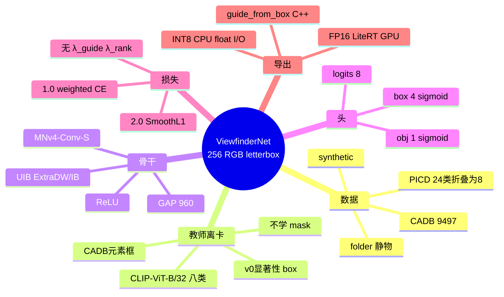

# 取景器模型结构脑图

可视化页：[model_structure.html](model_structure.html)（用浏览器打开）。

```mermaid
mindmap
  root((ViewfinderNet<br/>256 RGB letterbox))
    数据
      synthetic
      CADB 9497
      PICD 24类折叠为8
      folder 静物
    教师离卡
      CLIP-ViT-B/32 八类
      v0显著性 box
      CADB元素框
      不学 mask
    骨干
      MNv4-Conv-S
      ReLU
      UIB ExtraDW/IB
      GAP 960
    头
      box 4 sigmoid
      obj 1 sigmoid
      logits 8
    损失
      2.0 SmoothL1
      1.0 weighted CE
      无 λ_guide λ_rank
    导出
      FP16 LiteRT GPU
      INT8 CPU float I/O
      guide_from_box C++
```
